# Prime Cinema - Frontend

A modern, premium cinema booking platform built with React and Vite, featuring a sleek black, white, and red design inspired by contemporary minimalism.

## 📸 Screenshots

### Browsing

| Home | Movies | Showtimes | Cinema Locations |
|---|---|---|---|
| 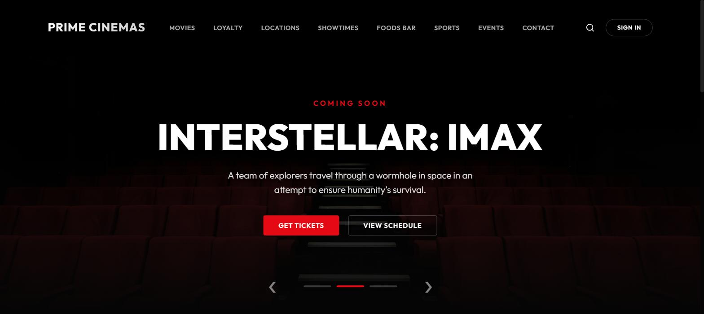 | 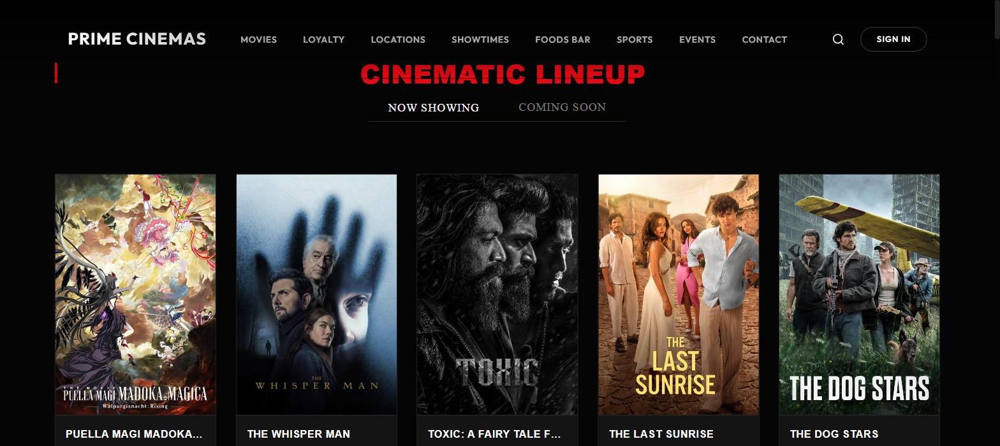 | 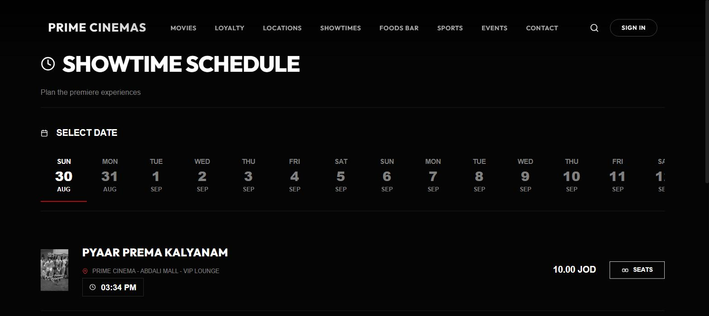 | 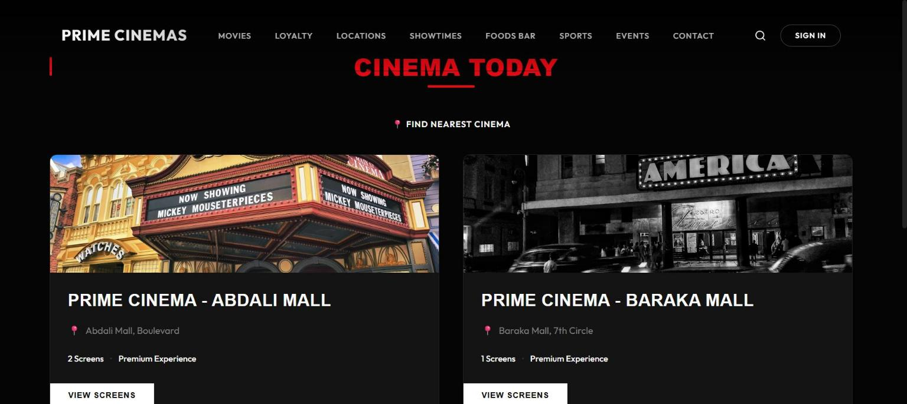 |

### Booking flow

| Seat Selection | Sign In / Guest | Payment | Booking Confirmed |
|---|---|---|---|
| 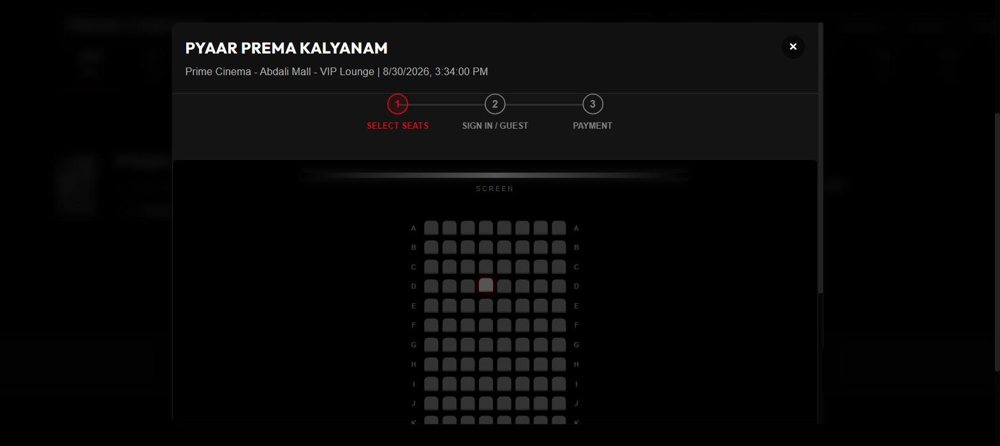 | 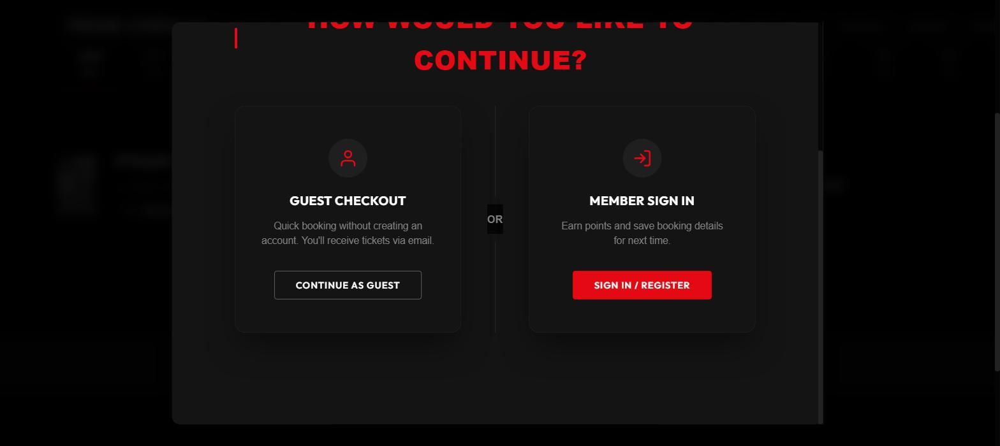 | 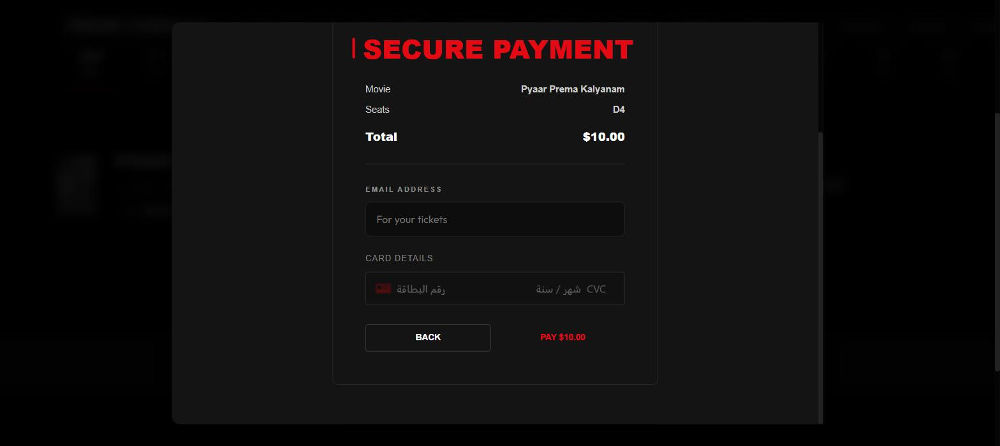 | 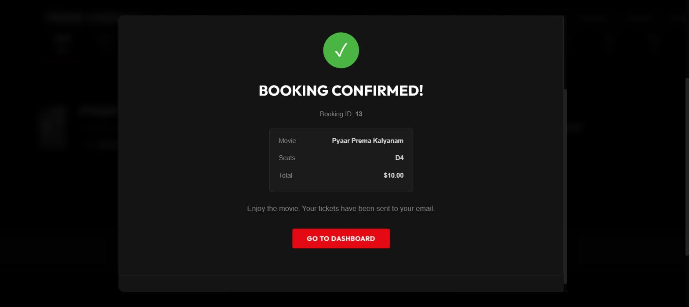 |

### Account

| Login | Register | Dashboard | Loyalty Club |
|---|---|---|---|
| 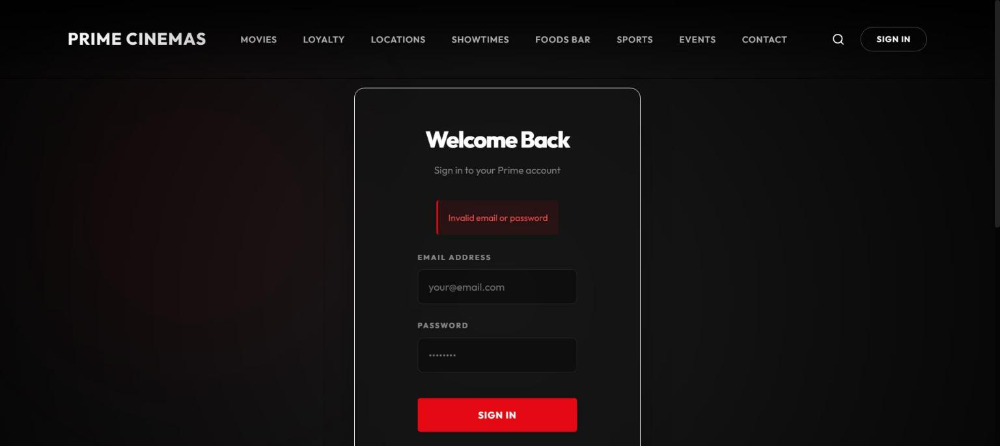 | 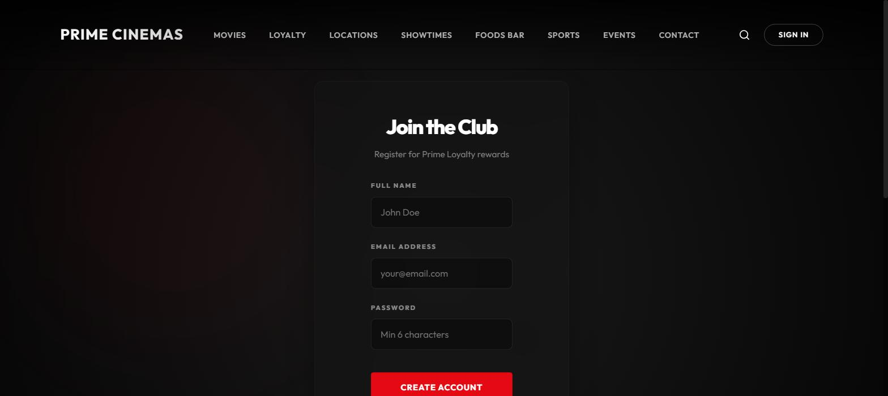 | 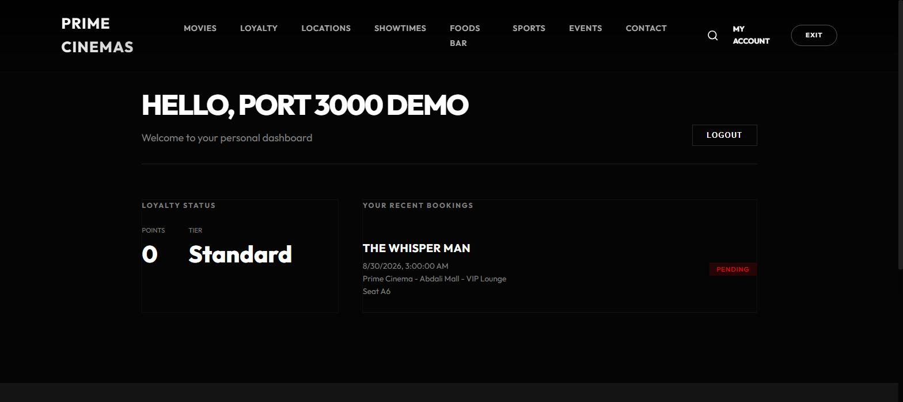 | 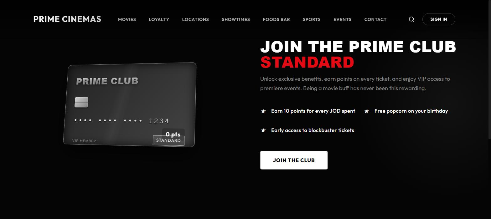 |

### More

| Foods Bar | Sports | Events & Experiences | Contact |
|---|---|---|---|
| 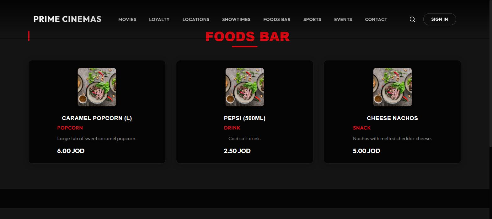 | 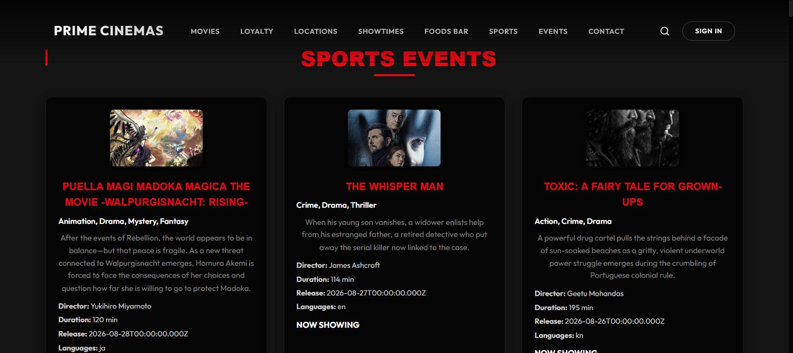 | 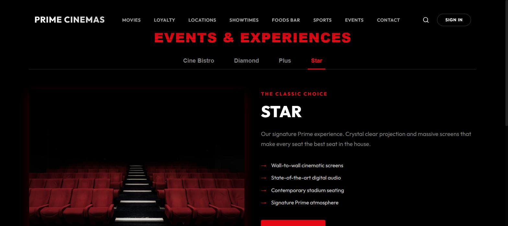 | 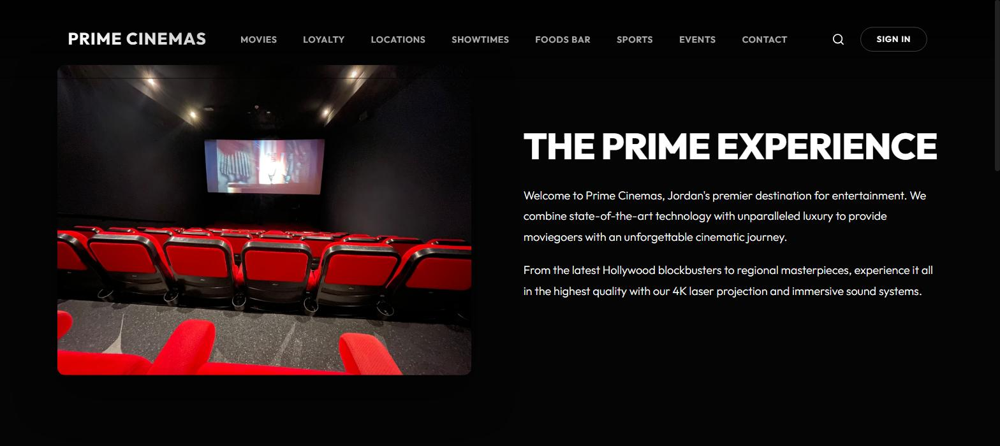 |

| 404 Page |
|---|
| 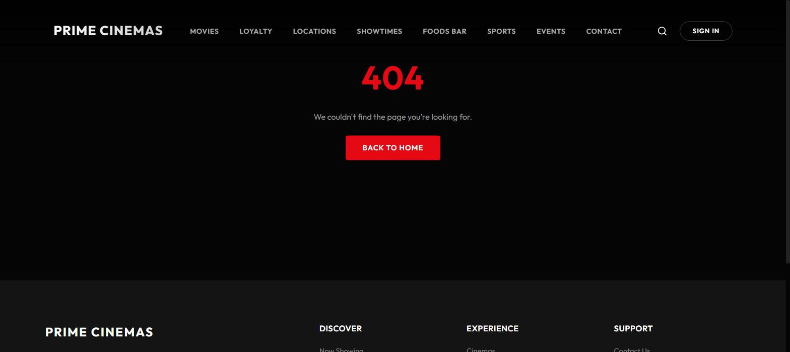 |

## 🎬 Features

- **Responsive Design**: Fully responsive UI optimized for all devices
- **Movie Browsing**: Browse current movies with detailed information
- **Showtimes**: View movie schedules in a clean list layout
- **Quick Booking**: Fast and intuitive booking flow
- **Cinema Locations**: Find nearby Prime Cinema locations
- **Loyalty Program**: Premium loyalty card system with perks
- **Modern UI**: Bold typography, minimal design, and smooth animations

## 🚀 Tech Stack

- **React 18** - UI library
- **Vite** - Build tool and dev server
- **React Router** - Client-side routing
- **Montserrat Font** - Typography

## 🎨 Design System

- **Color Palette**: 
  - Primary: Black (#050505)
  - Accent: Red (#E50914)
  - Text: White (#FFFFFF)
  - Gray tones for secondary elements
- **Typography**: Montserrat (300-900 weights)
- **Layout**: Minimal, bold, and clean

## 📦 Installation

```bash
# Install dependencies
npm install

# Copy the env template and fill in real values (all vars need the VITE_ prefix)
cp .env.example .env

# Start development server (runs on port 9000)
npm run dev

# Build for production
npm run build

# Preview production build
npm run preview
```

## 🔧 Configuration

### Port Configuration
The dev server runs on **port 9000** by default (see `server.port` in `vite.config.js`).

### API Configuration
The frontend connects to the backend API at the URL in `VITE_API_BASE_URL` (see `.env.example`).
By default — if that variable is not set — it falls back to the deployed backend at
`https://prime-cinema-backend-1.onrender.com/api`. To point at a local backend instead, set:

```
VITE_API_BASE_URL=http://localhost:4000/api
```

### Environment Variables
All client-exposed env vars must be prefixed `VITE_` (a Vite requirement — anything without the
prefix is invisible to browser code and will silently break the feature that needs it, e.g. a
missing prefix on the Stripe key breaks the entire payment step). See `.env.example` for the full
list: `VITE_API_BASE_URL`, `VITE_STRIPE_PUBLISHABLE_KEY`, `VITE_UNSPLASH_ACCESS_KEY`.

## 📁 Project Structure

```
prime_cinema_front/
├── src/
│   ├── components/       # React components
│   │   ├── Hero.jsx
│   │   ├── Navbar.jsx
│   │   ├── Showtimes.jsx
│   │   ├── MovieGrid.jsx
│   │   ├── QuickBooking.jsx
│   │   ├── LoyaltySection.jsx
│   │   └── ...
│   ├── services/         # API services
│   │   └── api.js
│   ├── App.jsx          # Main app component
│   ├── main.jsx         # Entry point
│   └── index.css        # Global styles
├── public/              # Static assets
├── vite.config.js       # Vite configuration
└── package.json
```

## 🌐 Available Routes

- `/` - Home page with hero and quick booking
- `/movies` - Browse all movies
- `/showtimes` - View movie schedules
- `/locations` - Cinema locations
- `/club` - Loyalty program
- `/foods-bar` - Concessions menu
- `/sports` - Sports events
- `/events` - Upcoming events
- `/contact` - Contact page
- `/login`, `/register` - Authentication
- `/dashboard` - User dashboard (protected — redirects to `/login` if signed out)
- any other path - 404 page

## 🎯 Key Components

### Hero
Full-screen hero section with call-to-action buttons

### QuickBooking
Interactive booking widget with movie/cinema/date/time selection

### Showtimes
List-based layout showing upcoming movie sessions with real-time data

### MovieGrid
Grid display of current movies with poster images

### LoyaltySection
Premium 3D animated loyalty card presentation

## 🔗 Backend Integration

This frontend requires the Prime Cinema backend API to be running. The backend handles:
- Movie data
- Showtime schedules
- Cinema information
- Booking management

**Backend Repository**: `cinema_booking_API-main`
**Default deployed backend**: `https://prime-cinema-backend-1.onrender.com/api` (override with
`VITE_API_BASE_URL` — see Configuration above)

## 📱 Browser Support

- Chrome (latest)
- Firefox (latest)
- Safari (latest)
- Edge (latest)

## 👥 Development

Created for Prime Cinemas - Jordan's premier entertainment destination.

## 📄 License

Private project - All rights reserved
